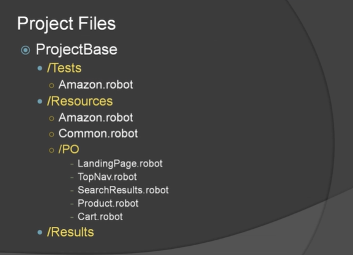

# Agenda
- Overview
- Preview of Final Solution
- Introduction to User-Defined Keywords
- Break Up the Script Into Keywords
- Move Keywords to Resource File
- Add Set Up and Tear Down
- Create Page Objects
- Explore Gherkin to Increase Readability

## Overview
- Readability
  - Script (intent)
  - Results
  - Failures
- Reausability
  - 1 line replaces many
- Maintainability
  - All locators in one spot
  - Page object logic change in 1 file can fix many test cases

## Preview of Final Solution
- Might be All You Need to See
- Results are Critical
  - Compare the results output
  - Examine failures 

#### Original Script

#### Keywords Moved to Resource File

#### Script Keywords Page Objects

#### Project Files

#### More Readable Script

#### More Readable Results

#### Easier to Determine Failures
